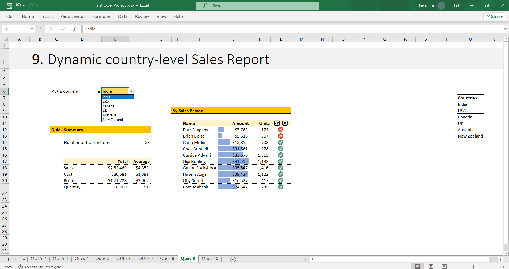
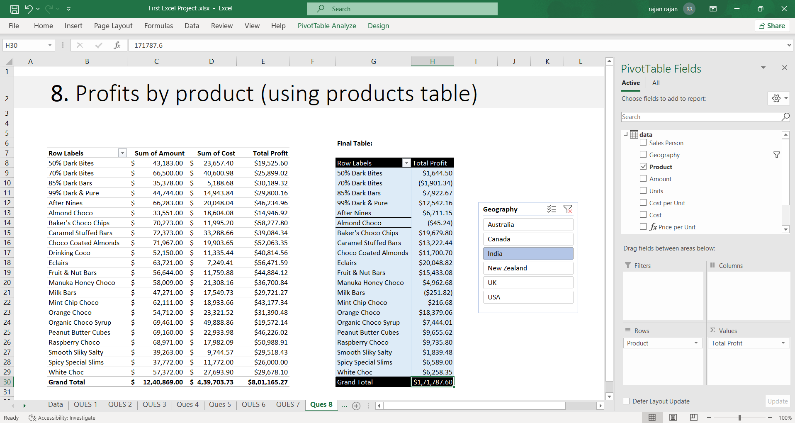

# 🍫 Chocolate Sales Data Analysis | Microsoft Excel

## 📊 Project Overview

This project analyzes chocolate manufacturing and distribution sales data using Microsoft Excel. The objective was to transform raw sales transactions into actionable business insights through exploratory data analysis, profitability analysis, anomaly detection, and interactive reporting.

**Dataset:** 300+ Sales Transactions

## 🛠 Skills Demonstrated

* Pivot Tables & Pivot Charts
* Advanced Excel Formulas
* Conditional Formatting
* Data Validation
* Exploratory Data Analysis (EDA)
* Profitability Analysis
* Anomaly Detection
* Interactive Reporting

## 📌 Key Analyses

* Sales by Country Analysis
* Product Profitability Analysis
* Anomaly Detection
* Best Salesperson Analysis
* Dynamic Country-Level Sales Reporting
* Product Discontinuation Recommendations

## 🖼 Project Screenshots

### Dynamic Country-Level Sales Report

### Product Discontinuation Analysis

### Product Profitability Analysis

### Sales by Country Analysis

### Anomaly Detection

## 📂 Repository Contents

* First Excel Project.xlsx
* README.md
* images/

## 👨‍💻 Author

**Rajan**

B.Tech (AI & ML) | Aspiring Data Analyst

Excel • SQL • Python • Power BI
